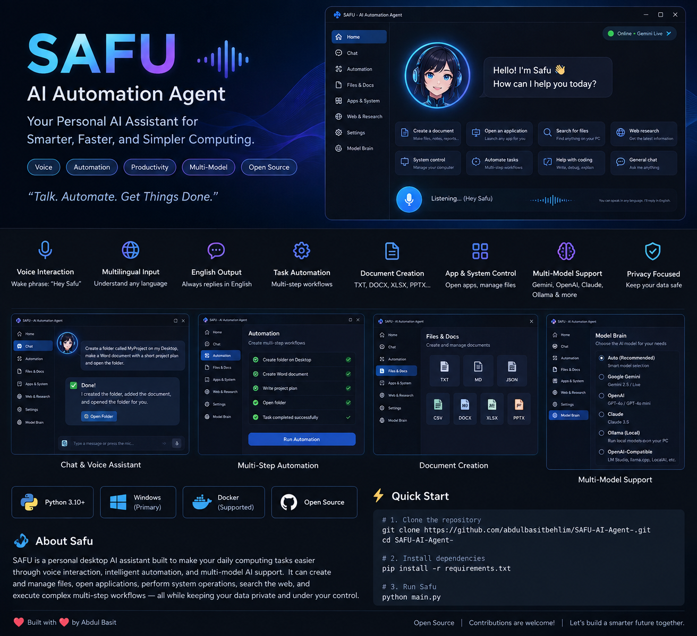

<div align="center">

# SAFU AI Automation Agent

**A Windows personal AI assistant for voice interaction, desktop automation, document creation, research, and multi-model AI workflows.**

[](https://github.com/abdulbasitbehlim/SAFU-AI-Agent/actions/workflows/ci.yml)
[](./VERSION)
[](https://www.python.org/)
[](#platform)
[](#docker)
[](#privacy--security)

**Talk • Automate • Create • Get Things Done**

</div>

## Interface & Automation Overview



> Project overview showing SAFU's intended interface and automation capabilities. The running UI may vary slightly by configuration and platform.

## About SAFU

**SAFU AI Automation Agent** is a personal desktop AI assistant developed and maintained by **Abdul Basit Behlim** to make everyday computer work faster and more practical. It combines real-time voice interaction, multilingual understanding, English voice replies, file and document management, desktop automation, web/research tools, and optional multi-model AI routing in one application.

SAFU can create and manage files, open applications, search local drives, execute multi-step workflows, create office documents, assist with coding and research, and delegate demanding tasks to cloud or local AI models.

**Current public release:** `v0.0.1`

## Key Features

- **Voice interaction** with the wake phrase **“Hey Safu”**
- **Multilingual input** with **English-only replies**
- **Low-latency conversational mode** using Gemini Live when configured
- **Multi-model support** for Gemini, OpenAI, Anthropic/Claude, Ollama, and OpenAI-compatible local servers
- **Desktop automation** for applications, windows, common system actions, and multi-step workflows
- **File and folder automation** across normal Windows drives and user folders
- **Document creation** for TXT, Markdown, JSON, CSV, DOCX, XLSX, and PPTX
- **Research and web tools** for search, summaries, briefings, and browser-assisted work
- **Local AI option** through Ollama or compatible local inference servers
- **Privacy-focused public configuration** with personal memory, secrets, and login sessions excluded from Git
- **Safety boundaries** around destructive or sensitive operations

## Platform

SAFU is designed primarily for **Windows 10/11** because several features use Windows APIs, native application launching, microphone access, Windows user folders, desktop control, and DPAPI-protected configuration.

Recommended Python versions:

```text
Python 3.11 - 3.13
```

Newer Python versions may work, but local PocketSphinx wake-word support can fall back to the online wake path when a compatible binary wheel is unavailable.

## Quick Start

### 1. Clone the repository

```powershell
git clone https://github.com/abdulbasitbehlim/SAFU-AI-Agent.git
cd SAFU-AI-Agent
```

### 2. Install SAFU

Standard installation:

```powershell
python setup.py
```

Full installation with heavier browser/media integrations:

```powershell
python setup.py --full
```

### 3. Verify the installation

```powershell
python verify_safu.py --strict
```

### 4. Start SAFU

```powershell
python main.py
```

or double-click:

```text
run_safu.bat
```

## AI Models

| Provider | Typical use | Internet |
|---|---|---|
| Gemini | Live voice + text AI | Required |
| OpenAI | Optional secondary model | Required |
| Anthropic / Claude | Optional secondary model | Required |
| Ollama | Local models | Not required after model setup |
| OpenAI-compatible server | LM Studio, llama.cpp, LocalAI, Jan, etc. | Depends on server |

Example Ollama configuration:

```text
Provider: Ollama
URL:      http://localhost:11434
Model:    llama3.2
```

See [`MODELS_AND_AUTOMATION.md`](MODELS_AND_AUTOMATION.md) for more details.

## Example Commands

```text
Hey Safu, create a Word document on my Desktop called ProjectPlan.docx.

Find my latest PDF on D drive and open it.

Create a folder called MyProject on my Desktop, add a notes file,
and open the folder when you are finished.

Summarize this document and create an Excel table from the important data.

Open my browser and research the latest information about this topic.
```

## Project Structure

```text
SAFU-AI-Agent/
├── actions/                # Automation/tool actions
├── assets/                 # README and project visuals
├── config/                 # Public assets + safe configuration template
├── core/                   # Audio, wake word, model routing, safety helpers
├── dashboard/              # Optional remote dashboard
├── memory/                 # Memory code + empty example schema only
├── plugins/                # Drop-in plugin framework
├── scripts/                # Public-repository/privacy checks
├── .github/                # CI workflow and PR template
├── main.py                 # Application entry point
├── ui.py                   # PyQt6 desktop interface
├── setup.py                # Standard/full installer
├── Dockerfile              # Headless verification container
├── docker-compose.yml      # Verification + optional Ollama service
├── requirements-lite.txt   # Standard runtime dependencies
├── requirements.txt        # Full runtime dependencies
└── VERSION                 # Public release version
```

## Docker

Docker is included for **headless verification/development** and optional local-model infrastructure. It does **not** replace the native Windows desktop application because a Linux container cannot normally control the Windows desktop, launch host applications, use Windows DPAPI, or access the host microphone/GUI in the same way.

Build and run the verifier:

```bash
docker build -t safu-ai .
docker run --rm safu-ai
```

or:

```bash
docker compose up --build safu-check
```

Optional Ollama service:

```bash
docker compose --profile local-llm up -d ollama
```

## Privacy & Security

This public repository intentionally excludes personal runtime data and credentials, including:

```text
config/api_keys.json
memory/long_term.json
memory/*.db
config/certs/
config/whatsapp_web/
**/token*.json
**/client_secret*.json
.env*
logs/
screenshots/
downloads/
```

Safe templates are provided instead:

- `config/api_keys.example.json`
- `memory/long_term.example.json`

Before publishing changes, run:

```powershell
python scripts/check_public_repo.py
```

See [`SECURITY.md`](SECURITY.md) for security guidance.

## Verification & CI

Local package check:

```powershell
python verify_safu.py
```

Full Windows runtime check after dependencies are installed:

```powershell
python verify_safu.py --strict
```

GitHub Actions verifies Python 3.11, 3.12, and 3.13, checks source compilation, runs the SAFU package preflight, and scans the repository for private runtime files and common credential patterns.

## Author

**SAFU AI Automation Agent** is developed and maintained by **Abdul Basit Behlim**.

- GitHub: [abdulbasitbehlim](https://github.com/abdulbasitbehlim)
- Repository: [SAFU-AI-Agent](https://github.com/abdulbasitbehlim/SAFU-AI-Agent)
- SAFU-specific project design, branding, integrations, documentation, UI work, automation workflows, and modifications authored by Abdul Basit Behlim are copyright © 2026 Abdul Basit Behlim.

## Contributing

Issues, bug reports, feature ideas, and pull requests are welcome. Please do not commit API keys, authentication tokens, browser sessions, personal memory databases, or other private runtime data.

## License & Attribution

Copyright © 2026 **Abdul Basit Behlim** for SAFU-specific original contributions and modifications.

This repository also contains material subject to existing third-party license obligations. Those legal notices are retained in [`LICENSE`](LICENSE) and [`NOTICE`](NOTICE). They do not imply sponsorship or endorsement of SAFU.

---

<div align="center">

**SAFU AI Automation Agent v0.0.1**  
Developed and maintained by **Abdul Basit Behlim**

[GitHub Repository](https://github.com/abdulbasitbehlim/SAFU-AI-Agent)

</div>
